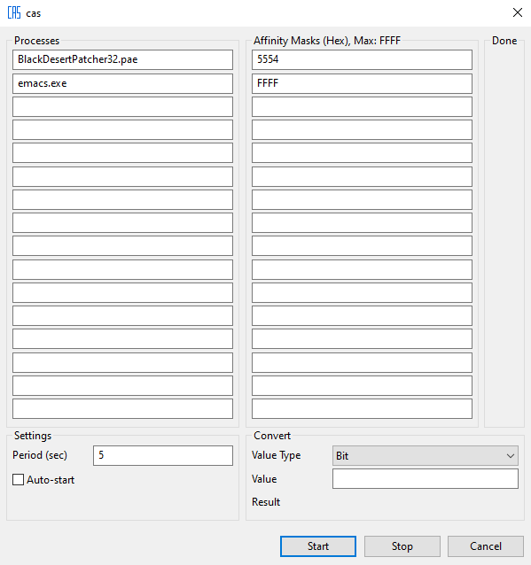

# cas

Simple utility for setting CPU affinity of processes for Windows.

# Usage

cas takes process name and affinity mask pairs as input from the user. It periodically queries the given processes in the background to change the affinity masks.

## User Dialog

- Processes (List of process names to query - every process needs matching affinity mask)
- Affinity Masks (List of affinity masks to set for given process - affinity mask should be given in hex format)
- Done (Indicator to see if desired affinity masks is set)
- Settings (Program options)
  - Period: Query period in seconds [1-99]
  - Auto-start: Start querying automatically next time when you open cas
- Convert (Affinity mask converter between bit and hex representation)
  - Value Type: Value type that you want to convert from (Bit or Hex)
  - Value: Value that you want to convert
  - Result: Result of the conversion
- Start (Start querying)
- Stop (Stop querying)
- Cancel (Change to tray mode)
- Tray Menu (Right-click to tray icon)
  - cas: Redirects to this page.
  - Exit:  Quit cas.

# Download

You can get latest build as zip archive here: [cas.zip](https://raw.githubusercontent.com/wiki/nukoseer/cas/cas.zip)

# Media

