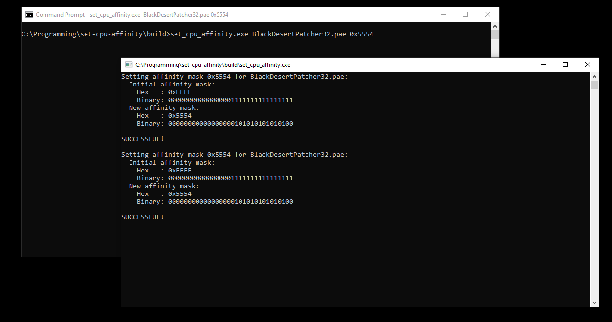

# set-cpu-affinity
Little command-line tool to set cpu affinity of a particular process on Windows.

## Usage
`set_cpu_affinity.exe <process_name> <affinity_mask (0xHEX or INTEGER)>`

_Note: Some programs may require administrator rights._

## Media
| *Before* |
|:--:| 
|  |

| *Run* |
|:--:| 
|  |

| *After* |
|:--:| 
|  |